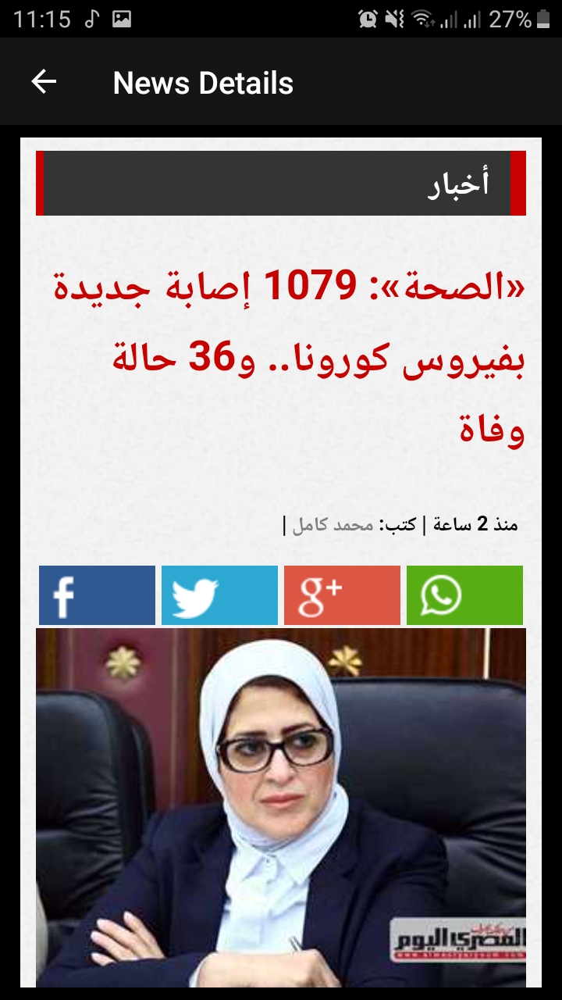

# Images
,
,
,
,
,
,
,

# News_App
this app presents the top-headline News in the main page , and provide the ability to search news by Category , and also in the search bar you can type Keywords or phrases to search for in the article title and body and search support Arabic and English language 

